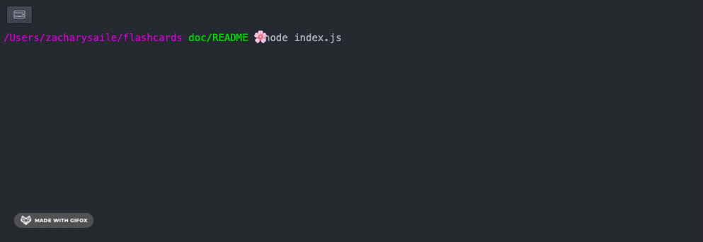
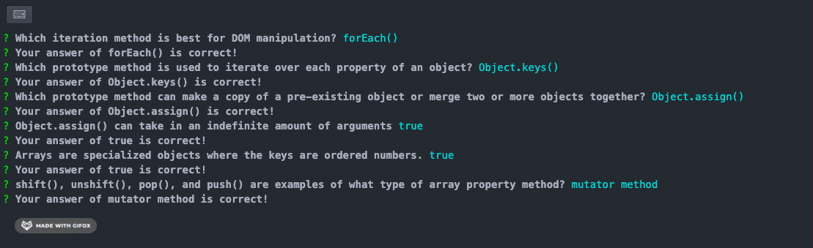

# Flashcards

## Table of Contents

- [Overview](#overview)  
- [Contributor](#contributor)  
- [Technologies Used](#technologies-used)  
- [Instructions](#instructions)  
- [Application In Use](#application-in-use)  

## Abstract
This is a flashcard style quiz game that is fully operational through the
command line interface (CLI). The game will walk you through a series of multiple choice questions, or flashcards. You will be able to answer them one at a time, and the game will tell you if you have answered correctly or not. Upon completion of the of all flashcards, the command line will display a message detailing what percentage of flashcards were answered correctly.

## Contributor

- Zachary Saile

## Technologies Used

- Javascript

## Set Up and Game Play Instructions

1. Fork and clone this repo down on your machine.

2. In your terminal, navigate to the root directory of this repo (`cd flaschcards/`) and then enter `node index.js` into the command line.

3. Dialogue will appear letting you know how many flashcards are in the deck, along with displaying your first question.

4. Use the up and down arrows to navigate the multiple choice selections and use the return key to submit your choice.

5. A message will appear telling you if your guess was correct or incorrect, followed by the next question.

6. Once you have finished answering all of the questions, you will see a message letting you know what percentage of your answers were correct. This ends the game.

## Application In Used

1. Starting the game and navigating the choices

2. Finishing the Game

